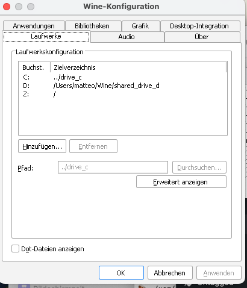
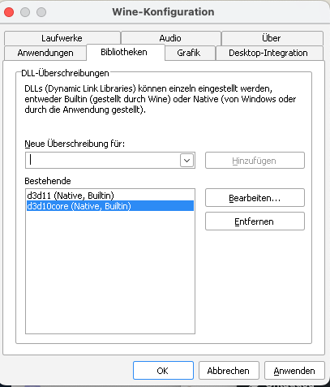

# Falcon 4.37 and Weapon Delivery Planner on MacOS

This is how I can fly Falcon BMS and use WeaponDeliveryPlanner on Intel and Apple Silicon Macs. As far as I can tell everything works pretty well. Even networking and IVC voice comms do work. It's even possible to use Headtracking via [MacOpentrack](../MacOpentrack.md) which I also maintain, but that's out of scope of this document.

I'm not installing Falcon into the virtual drive "C:" but into a shared virtual drive "D:". This is necessary to be able to use tools such as Weapon-Delivery-Planner (WPD). This may change in future but for now this is required due to .NET problems: I found that the FalconBMS-Alternative-Launcher only works with with wine-mono whereas WDP needs a real .NET 4.8. If you don't plan to use WPD or want to get to know Falcon BMS first, you may skip and simply some steps and install directly to the drive "C:".

Tested with
- Falcon 4.37.6
- macOS Sonoma
- wine 9.0.3
- wine-mono 9.4.0
- WeaponDeliveryPlanner 3.7.24.232
- Sony PS5 Controller via Bluetooth or USB

## Install Wine (stable 9.0.3)
Using homebrew `brew install --cask --no-quarantine wine-stable winetricks`

Or macports `sudo port install wine-stable winetricks` (but install the x86_64 architecture - not sure if this happens automatically).

Create the base install directory. Note that the base directoy `~/Wine/` is just my personal choice you can change it. `~` expands to your home-directy `$HOME` e.g. /Users/yourname

    mkdir -p ~/Wine/

Because I want to use WeaponDeliveryPlanner (which you probably will eventually) we'll install the main software products into a separate virtual drive shared by two wine prefixes (kind of a virtual windows installation). Create the directory for drive D:

    mkdir -p ~/Wine/shared_drive_d

Let's create the wine prefix for Falcon BMS and configure a drive "D" pointing tofrom above `~/Wine/shared_drive_d` via `WINEPREFIX=~/Wine/BMS winefcg`:

Install Falcon 4.0 (I got it from GOG.com, it's included in Falcon-3 as hidden asset). Choose Options and Install into drive "D:" D:\Falcon 4.0 e.g.

    WINEPREFIX=~/Wine/BMS wine ~/Downloads/setup_falcon_4_2.0.0.1.exe

Launch it once. On Apple Silicon you will not be able to actually run it, but it's fine.

Install Falcon BMS and again choose drive D: as destination

    WINEPREFIX=~/Wine/BMS wine ~/Downloads/Falcon\ BMS_4.37.6_Full_Setup/Falcon\ BMS_4.37.6_Full_Setup.exe

## Weapon Delivery Planner

    # Copy BMS prefix to BMS_Tools
    cp -r ~/Wine/BMS ~/Wine/BMS_Tools

    # Weapon Delivery Planner needs a real .NET 48 installation, it does not work in the same prefix:
    WINEPREFIX=~/Wine/BMS_Tools winetricks -q dotnet48
    
Again configure a drive "D" pointing to ~/Wine/shared_drive_d via `WINEPREFIX=~/Wine/BMS_Tools winefcg` like we did before.

Download Weapon-Delivery-Planner http://www.weapondeliveryplanner.nl/download/index.html. Unzip and put it into your dirve "D:" ~/Wine/shared_drive_d. I remove the version number from the directory name. My final directory tree looks like this:

    /Users/matteo/Wine
    ├── BMS
    │   ├── dosdevices
    │   └── drive_c
    ├── BMS_Tools
    │   ├── dosdevices
    │   └── drive_c
    └── shared_drive_d
        ├── Falcon 4.0
        ├── Falcon BMS 4.37
        └── Weapon_Delivery_Planner

Back to BMS install DXVK

    curl -L https://github.com/Gcenx/DXVK-macOS/releases/download/v1.10.3-20230507-repack/dxvk-macOS-async-v1.10.3-20230507-repack.tar.gz > ~/Downloads/dxvk-macOS.tgz
    tar -xvzf ~/Downloads/dxvk-macOS.tgz
    # unpack
    tar -C ~/Downloads/ -xzvf ~/Downloads/dxvk-macOS.tgz
    # remove gatekeeper quarantine
    sudo xattr -cr ~/Downloads/dxvk-macOS-async-*
    
    # copy dlls
    cp -v ~/Downloads/dxvk-macOS-async-*/x64/*.dll ~/Wine/BMS/drive_c/windows/system32
    cp -v ~/Downloads/dxvk-macOS-async-*/x32/*.dll ~/Wine/BMS/drive_c/windows/syswow64

Now configure DLL overrides for d3d11 and d3d10core via `WINEPREFIX=~/Wine/BMS winecfg`:

I found that the Falcon BMS Alternative Launcher works better with newer wine-mono versions than the stock 8.1, so I alsways install at least 9.2.0.

    curl -L https://dl.winehq.org/wine/wine-mono/9.4.0/wine-mono-9.4.0-x86.msi > ~/Downloads/wine-mono.msi
    WINEPREFIX=~/Wine/BMS wine ~/Downloads/wine-mono.msi

I recommend to add these values to the registry of at least the ~/Wine/BMS prefix, otherwise the mac Alt-KEy does not work and you cannot use keycommnds like Alt-C+P to show/hide the pilot model in the cockpit.

For that create a file mac.reg with these contents:

    Windows Registry Editor Version 5.00

    [HKEY_CURRENT_USER\Software\Wine\Mac Driver]
    "LeftOptionIsAlt"="Y"
    "RightOptionIsAlt"="Y"

Launch the regedit `WINEPREFIX=~/Wine/BMS wine regedit` and *import* the file using the menu command. Perhaps do the same for WINEPREFIX=~/Wine/BMS_Tools wine regedit

You can now launch the Falcon Launcher. From there you cannot launch WPD. It'll have errors.

    WINEPREFIX=~/Wine/BMS wine ~/Wine/shared_drive_d/Falcon\ BMS\ 4.37/Launcher/FalconBMS_Alternative_Launcher.exe

or

    WINEPREFIX=~/Wine/BMS wine D:/Falcon\ BMS\ 4.37/Launcher/FalconBMS_Alternative_Launcher.exe

To launch WPD rather use

    WINEPREFIX=~/Wine/BMS_Tools wine ~/Wine/shared_drive_d/Weapon_Delivery_Planner/WeaponDeliveryPlanner.exe

or
    
    WINEPREFIX=~/Wine/BMS_Tools wine D:/Weapon_Delivery_Planner/WeaponDeliveryPlanner.exe

What I generally lile to do is open the File Explorer starting at D: and then I navigate to where I want to go:

    WINEPREFIX=~/Wine/BMS wine D:/Falcon\ BMS\ 4.37

or

    WINEPREFIX=~/Wine/BMS_Tools wine D:/WeaponDeliveryPlanner

Note that you don't have to always specify the Prefix if you define it for your Terminal session permanently:

    export WINEPREFIX=~/Wine/xyz

Another reasonable thing to do would be creating a script file such as `startFalconAndWDP.command`:

     WINEPREFIX=~/Wine/BMS wine D:/Falcon\ BMS\ 4.37/Launcher/FalconBMS_Alternative_Launcher.exe &
     WINEPREFIX=~/Wine/BMS_Tools wine D:/Weapon_Delivery_Planner/WeaponDeliveryPlanner.exe &

or individual ones, so that you simply can double-click them,

Don't forget to make them .command files excecutable via `chmod a+x startFalconAndWDP.command`

