# IR Head-Tracking with X-Plane or Wine on macOS using Opentrack and DelanClip
By matatata - October 2024

# Introduction
In this document I'm describing how I was able to take full advantage of my [DelanClip](https://delanclip.com/shop/?a=tomatec) Fusion Pro on macOS despite the fact that it's currently not officially supported (I've been using it on Windows and it's working perfectly by the way). These are the problems I had to overcome on macOS:

1. When I was looking for it there were no official binaries of the [Opentrack](https://github.com/opentrack/opentrack) application available for macOS. There were builds around on the internet but they were very old and lacking important features.
2. Luckily Opentrack is opensource software and I was able to build a basic version of it myself. Getting the most important features to work as well however was a steep and extremely time consuming learning curve.
3. Once up and running I noticed several problems in the macOS version which I had to fix before it really became useable.
4. Although the *Delan Cam 1* camera is recognized by macOS out of the box it did not perform well initially. I found out that when connecting it to a Mac the initial exposure time settings are not ideal rendering it unusable for IR-Tracking. But once the settings are correct it performs very well. I've created a little utitily called [DelanCamUtil](https://matatata.gumroad.com/l/delancamutil) that will put the camera it the correct state.
5. The opentrack plugin for x-plane needed some improvements and compatibitlity with X-Camera was requested on the X-Plane forums very often.

I've now come to a point where things have really become useable and enjoyable so I'd like to share this information with the public:

## Setup "Delan Cam 1" for IR-Tracking

If you connect *Delan Cam 1* to a Mac it will not perform optimally on macOS like it does on Windows out of the box. Get the latest release of my [DelanCamUtil](https://matatata.gumroad.com/l/delancamutil) to fix that. Copy the app to your Applications folder or wherever you like and open it. In the system's menu bar on the right you'll then notice a little icon with three dots in the middle. It will be solid (like shown in the picture below) if a *Delan Cam 1* camera is connected. It'll be hollow otherwise.

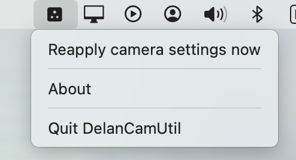

The app is lightweight and it actually does nothing but react if a *Delan Cam 1* camera is plugged in. It will then try to apply the recommended setting so that the camera performs optimally. It'll also do that when the app starts and the camera is already connected.

If you have reason to believe the app may have failed to set the camera's settings then you can manually apply the settings via the "Reapply camera settings now" menu item. Also note that the settings will not persist if you reconnect the camera or restart your computer. So its mandatory to have the app applies the settings at least once before you want to use the camera for IR-Tracking. Some users have added the app to their startup item list so they need not to worry about it anymore. Here's my "Login Items" section of macOS System Settings:

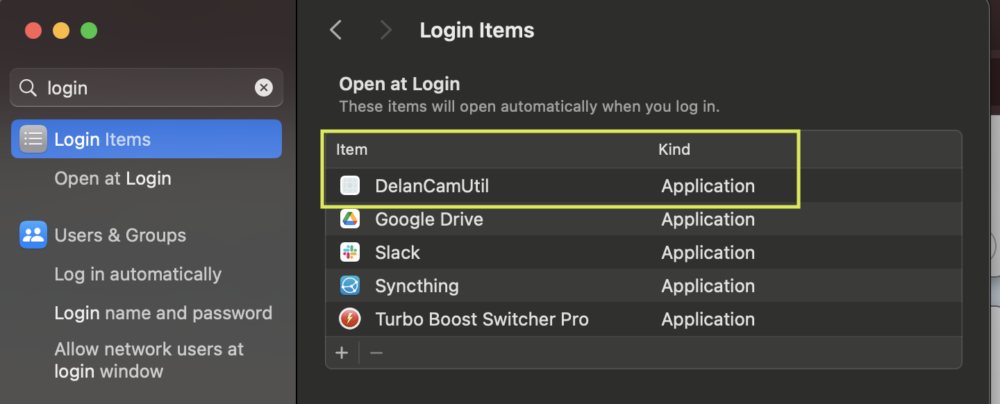

## Setup Opentrack
Opentrack is an opensource program capable of tracking your head's movement and get the movement data into your simulator or game. Get my latest builds of [MacOpentrack](https://matatata.gumroad.com/l/macopentrack). Choose the .dmg file that fits your platform. `x86_64` is for older Intel-Macs whereas everything else is optimized for Apple-Silicon. Open the disk image and copy the app to your Applications folder or wherever you like.
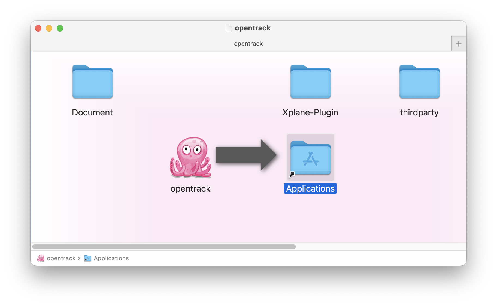

Note that I don't provide pre-built binaries directly at [my fork of opentrack on GitHub](https://github.com/matatata/opentrack). I offer code-signed and apple-notarised binaries at my [Gumroad-page](https://matatata.gumroad.com) allowing you to also support me financially. Of course you're welcome to build the software yourself as I make all my code changes available.

macOS might now ask you if Opentrack is allowed to access your Documents folder:
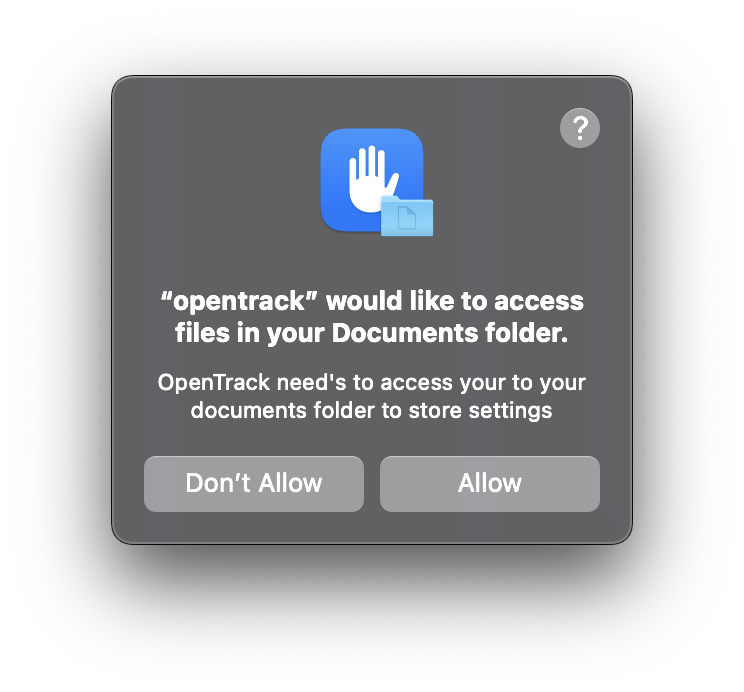

It is mandatory that you allow this because Opentrack currently stores its profiles in a folder called "Opentrack-2.3" within your Documents folder.

You'll then probably see a window like this:
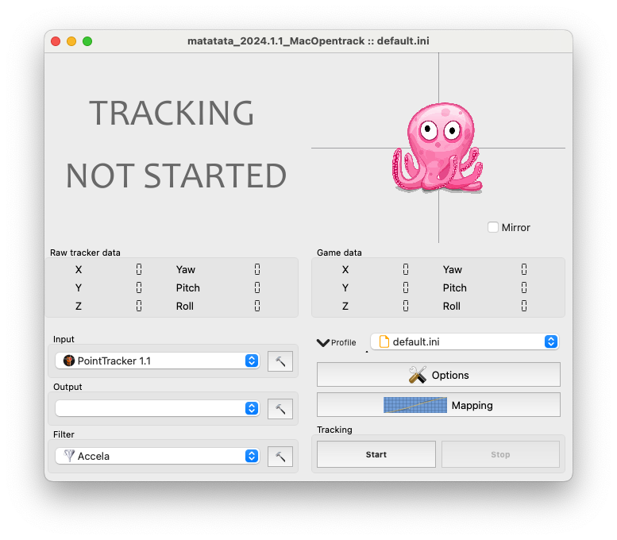

Opentrack basically consists of three modules:

1. The *Tracker* module usually tracks your physical head-movement. The *PointTracker* module would be used for IR-Tracking with the DelanClip. The module *neuralnet-tracker* would use a regular webcam. In this case your face is being tracked using machine learning techniques. It'll work with most webcams and the built-in FaceTime HD camera of you MacBook, but it'll have an notable impact on the system's CPU usage and tracking will not be nearly as good as with IR-Tracking. It can still be usabled if configured and tuned well, but I never was really happy with it.
2. The *Filter* module is used to fine tune the responsiveness and smoothness of the movements.
3. The *Output* module passes the filtered data to a consumer e.g. your game.

There are other trackers and output methods available, but they are not covered in this document and may not even be functional on macOS.

Follow [DelanClip's setup instructions](https://delanclip.com/manuals/delancam1-setup/) to install their profiles for Opentrack. It'll be applicable on macOS. When done and you've selected one of those profiles you'll note that the *Output* drop-down menu will be empty because the *freetrack 2.0 Enhanced* module is only available on Windows. On macOS please select the corresponding module called *Wine/X-Plane*:

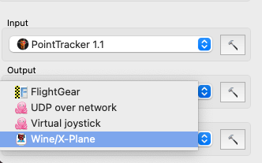

The *Wine/X-Plane* module covers two use cases: Wine and X-Plane.

1. [Wine](https://www.winehq.org) is a compatibility layer capable of running Windows applications on several POSIX-compliant operating systems, such as Linux, macOS, & BSD. In this document we'll not cover Wine in depth, but I have successfully used it with windows software running using wine 9.0 on macOS.
2. [X-Plane](https://www.x-plane.com) is a well-known flight simulator available for Windows, Linux and macOS. Opentrack provides a plugin for X-Plane to feed the motion-data from Opentrack into X-Plane via shared memory. Technically this means that other applications could read this data as well, but as far as I know the only consumer currently is the X-Plane plugin - hence the name X-Plane. We'll talk about the plugin later.

We'll now assume that you are not going to use the Wine integration but X-Plane. Open the output module's settings by clicking on the hammer right next to it. 
Select the wine variant "Disabled (X-Plane)":

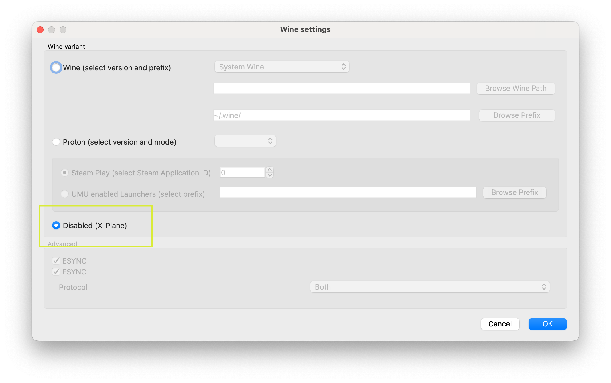

Otherwise you'll get an error message when starting tracking in case you don't have Wine installed.

### Basic configuration
Opentrack offers quite a lot you can and probably should configure to your liking. We can't cover it here, but I recommend to review Opentrack's *Options* and *Mappings* dialogs. Particularly you should configure the global keyboard shortcut "Center". By default the DelanClip provided profiles have that configured to the "Home"-key which might not be available on your MacBook's keyboard. Note that these are system wide shortcuts, so please use a key you don't use in other applications. Use combinations with one or more modifier keys (like control, option or shift). You can skip this now and come back later.

### Starting the tracker for the first time

Review the tracker's setting by clicking on the hammer right next to it. Make sure you have the right camera selected. Now start the tracker by pressing the button *Start*. Of course you'll first have to allow Opentrack to use the camera:

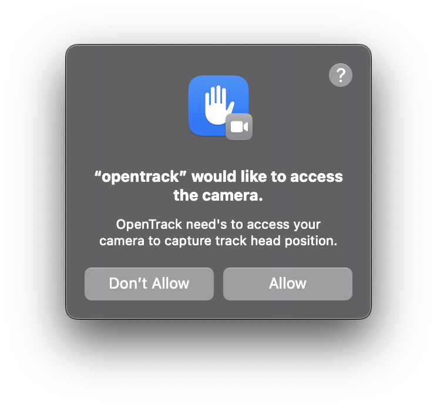

There might be another error message stating that the camera could not be accessed. Just dismiss it. Allow the camera usage and the hit the *Stop* button and hit *Start* one more time. The camera should now become active and the octopus should move in sync with your head movement - assuming your DelanClip is charged and turned on. Place your head to a neutral and central position then use the "Center" command that you have mapped in the previous step and see the octupus recenter.

There are a lot of things you could tweak in the settings, but we can't go over all that here as I'm no expert either. Luckily I found with IR-Tracking there's far less to configure since it's much smoother right from the sart. However please make sure that when opening the Point-Tracker's settings by clicking the hammer right next to it the tracker reports around 30 FPS and that the dots are crisp and rather small. They should look like white dots not like actual light sources. They should move synchronously with your head without notable latency.

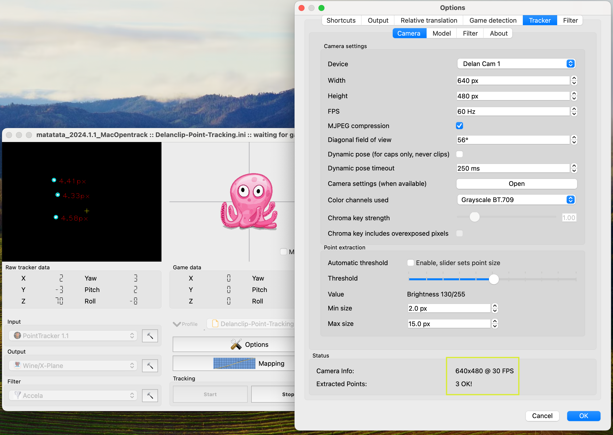

If however the PointTracker's FPS are only around 12 then the camera is not in the correct state. Stop tracking and chose the "Reapply camera settings now" in DelanCamUtils' menu and restart tracking. Check the FPS again. If nothing changes then you might have a different camera that DelanCamUtil does not know about. In this case other apps like "Webcam Setting" (available in the App-Store) or the command-line tool [uvc-util](https://github.com/jtfrey/uvc-util) which DelanCamUtil uses internally may help you find the settings that make your camera work better.

### Model Calibration
Most trackers will have an option to calibrate the model and so does the PointTracker. You can calibrate it now or come back later. Also you can repeat this whenever you change the positioning of the camera and/or your head-clip. You'll find the PointTracker's calibration option here:

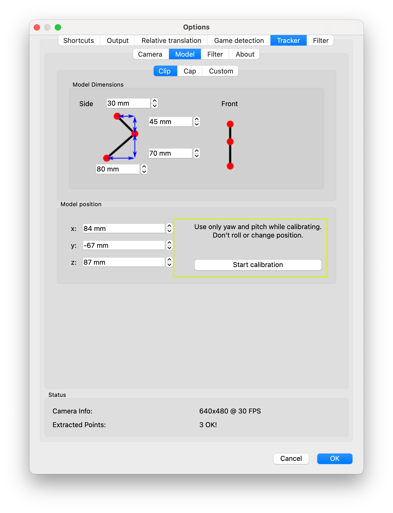

## Setup X-Plane

### Installing the X-Plane-Plugin
To make X-Plane receive the motion data from Opentrack you have to install a plugin that you'll find in the folder *Xplane-Plugin* on the disk image where you also did find Opentrack. The plugin only consists of a file name `opentrack_arm64.xpl` or `opentrack_x86_64.xpl` depending on which platform you have chosen. On an older intel-Mac you'll want the x86_64 file. Copy the file into path/to/X-Plane/Resources/plugins/.

Note that on an Apple-Silicon you might be using X-Plane in intel- aka Rosetta-mode so that you can use airplanes that are not yet optimized for Apple-Silicon. In this case also download the x86_64 *.dmg disk image and copy the intel version of the Opentrack plugin to X-Plane's plugin folder as well. You'll have to perform the Gatekeeper game for it too.

### Using the X-Plane-Plugin
Start a flight and verify that the plugin has been loaded. Check the "Plugin"-menu. You should see a menu "Opentrack" that should look like this or similar:

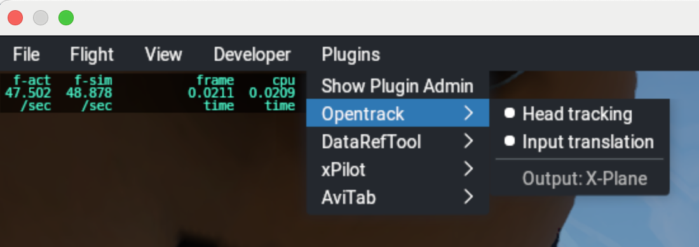

The menu-item "Head tracking" toggles between head tracking completely on or off. The menu-item "Input translation" toggles between full motion (roll, yaw and pitch and x, y and z) or rotations only. If you turn the translations off the virtual head always stays in the same position and you will be able to move around in the cockpit using the arrow keys as usual or by using quick looks. The dot's indicate the *on* state.

Depending whether you have the [X-Camera plugin](https://stickandrudderstudios.com/x-camera/) installed and enabled then the last menu item will read "Output: X-Camera" or "Output: X-Plane" indicating that the plugin will pass motion data to X-Camera or passing it to X-Plane respectively. X-Camera allows you to define views where you can individually choose whether head-tracking is turned on or off. For instance if you have defined a close-up view of your avionic instruments then you might want head-tracking to be disabled automatically as long as this view is active. If you disable or enable X-Camera then you must toggle the Opentrack plugin off and on again for it to notice X-Camera's state.

Full motion head tracking is always active on first start. So if you are not using head-tracking you need to turn tracking off. It's generally recommended that you define a key or controller-binding at least for the "Head tracking"-toggle so you can turn it on and off quickly:

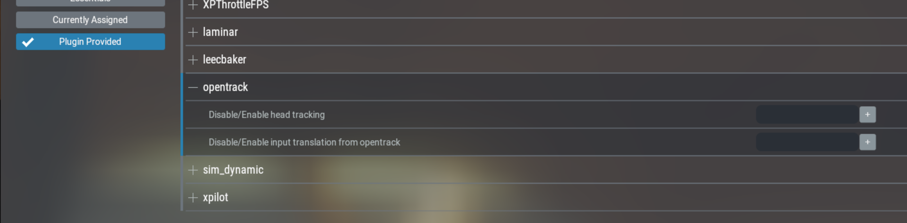

Remember to "Center" the view and start exploring. Happy flying!

## Opentrack and Wine
There are several wine-based solutions, but I only tested wine directly. For instance I successfully used IR-Tracking with [Falcon BMS](https://www.falcon-bms.com) and wine-stable 9.0 installed via [MacPorts](https://www.macports.org) (`sudo port install wine-stable`) and [Homebrew](https://brew.sh) (`brew install --cask --no-quarantine wine-stable`). Open the "Wine/X-Plane" module's settings and select the wine variant "Wine". If you're familiar with how wine works then you should know what to do. I might revisit this section and add more details in future.

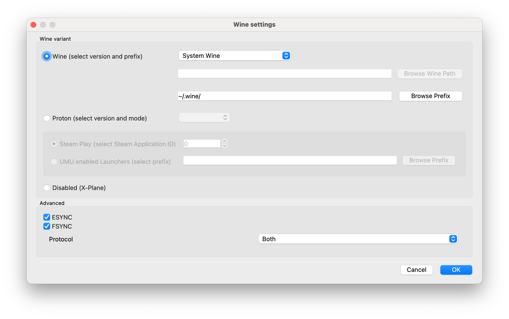

## Where to go from here
So there you have it. But don't stop here in case you feel something could be better. Go and look into Opentracks Options. You'll most like find a possibility to tweak it to your liking. A common issue might be that the x translation is reversed - meanding you move (not rotate) your head to the right, but the virtual pilots head moves to the left. This can be fixed in the options like this for instance:

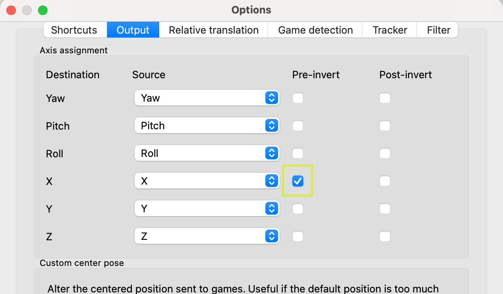

Also the *Mapping* configuration window is a very powerful and improtant tool and you should use it tweak how your physical movement is mapped to the virtual pilot's movements.

Look for other documentaton on opentrack - most of it should be applicable to Opentrack on macOS as well.

## Thanks and final words
Many thanks to cavu360 and AnthonyFracis for their generous support and help at the [X-Plane Forums](https://forums.x-plane.org/index.php?/forums/topic/292575-mac-silicon-head-tracking/). Last but not least many thanks to the developers of Opentrack!

Update: As of 15th October 2024 DelanEngineering's Tomasz is now supporting my work - so that opentrack and DelanClipUtil will stay up to date and available for his macOS customers. He also created [this link that gets you a 5 % discount](https://delanclip.com/shop/?a=tomatec) on your purchase if you decide to go with the a Delan Cam 1 IR-Tracking product.

