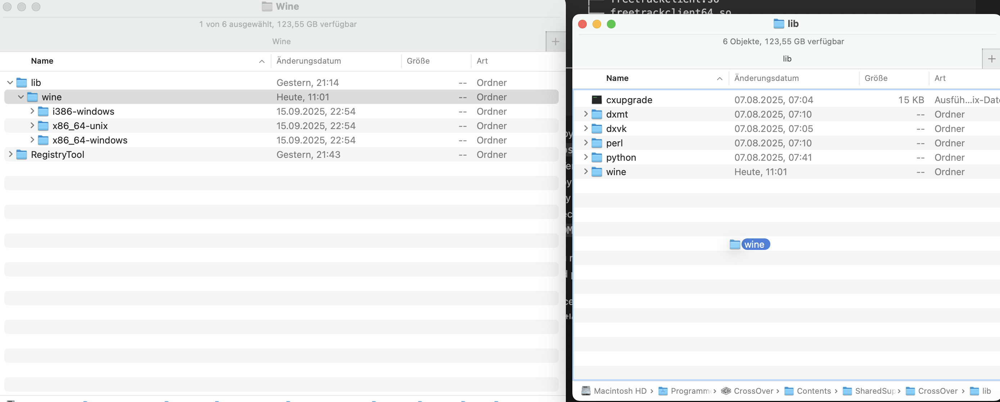
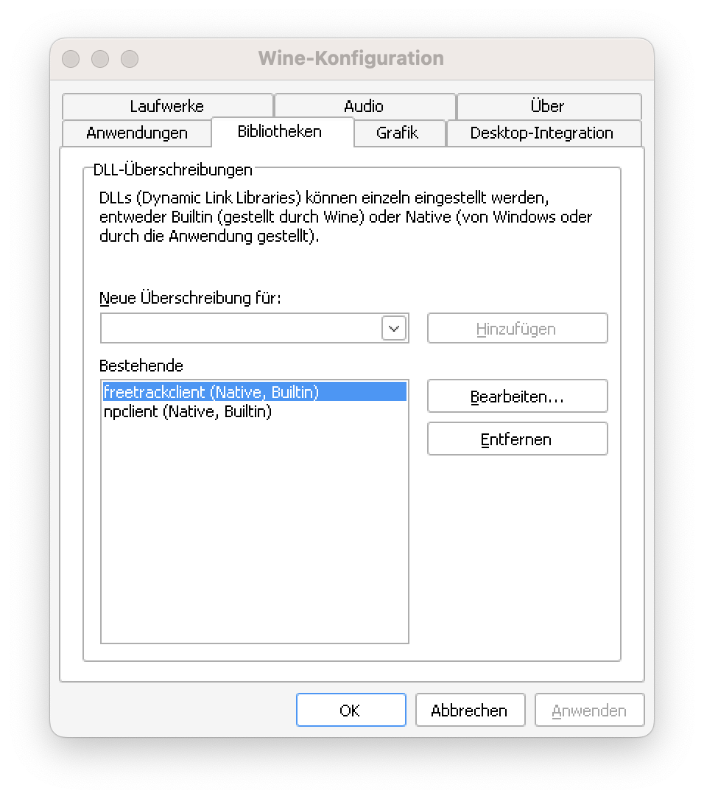

# Alreadsy outdated... TODO rewrite see wine-bridge/README.md
# Opentrack and Wine Integration 2.0

This is about my new approach of integrating Opentrack with Wine. I had to look into it because the current approach using the original Wine output module has problems on macOS and probably on Linux as well. See my discussion in https://bugs.winehq.org/show_bug.cgi?id=58580 and https://trac.macports.org/ticket/72792 if you're interested in why the approach using the opentrack-wrapper-wine.exe.so winelib is not future proof at least on macOS and Linux.

My approach uses Wine's newer UnixCall-Interface and I've successfully tested my solution in Streams's Proton on Linux, Crossover 25 on macOS and with stock Wine on Linux and macOS. It requires an extra installation step but other than that I think it's more straightforward and stable than the previous method.

## Uninstall Wine builtin dlls

find /opt/local/lib /Applications/CrossOver*.app /Applications/Wine*.app \( -name "freetrackclient*.*" -o -name "npclient*.*"  \) -exec sudo rm {} \;

## Uninstall opentrackclient lib

sudo rm /opt/local/include/opentrackclient.h
sudo rm /opt/local/lib/libopentrackclient.*

## Installation

The installation should be identical on most Wine-based solution you use to run your windows games and it's only a matter of finding the right location to copy files into. I haven't tested them all, but as long as its based on some wine version 9 and upwards chances are good that it'll work. Unless they're doing something strange and/or macOS and its security measures interferes with it. Same applies to Linux, but like I said it work well with Steam's Proton.

Most wine based solutions should have a wine installation underneath it *somewhere*. There will be a directory where wine stores its socalled builtin libraries and I'll use the placeholder `<wine-builtin-libs-dir>` from now on.

Examples for the `<wine-builtin-libs-dir>` are:

macOS homebrew wine: `/Applications/Wine\ Stable.app/Contents/Resources/wine/lib/wine`.
macOS macports:  `/opt/local/lib/wine`

macOS CrossOver 25: `/Applications/CrossOver.app/Contents/SharedSupport/CrossOver/lib/wine`

Linux Proton: TODO

We'll have to copy custom versions freetrackclient(64).dll and npclient(64).dlls and their accompanying .so|.dylib-files into the aforementioned location so that Wine will find them. They are so called *builtin* wine-dlls that will be loaded whenever Wine's dllloader tries to load a dll with that name. The builtin dlls can call into unix-land and thus are able to directly access the headpose data of the opentrack-instance running on macOS or Linux. You can change that behavior using dll-overides via `winecfg` in case you do want to use the original dlls instead of the custom dlls - perhaps because you want to try something out and run a windows opentrack inside Wine.

### Copying the builtin-dlls and .so files

The directory structure will probably look like this:

    .
    ├── i386-windows
    ├── x86_64-unix
    └── x86_64-windows

There might be `i386-unix` as well, but on macOS it is of no importance.

You should find the following libraries and dlls besides the opentrack.app in `<DMG>/Wine/lib/wine` inside the .dmg disk image or `<installprefix>/libexec/opentrack/wine/lib/wine` when built on Linux:

    .
    ├── i386-windows
    │   ├── freetrackclient.dll
    │   └── npclient.dll
    ├── x86_64-unix
    │   ├── freetrackclient.so
    │   ├── freetrackclient64.so
    │   ├── npclient.so
    │   └── npclient64.so
    └── x86_64-windows
        ├── freetrackclient64.dll
        └── npclient64.dll

Copy all these files to their respective directory in `<wine-builtin-libs-dir>`. On macOS you might not be able to do this for CrossOver using copy commands from the command line because CrossOver is a sandboxed app and macOS protects it. However if you copy the files via Finder it'll work as macOS now thinks that you're doing so deliberately. An easy way is to do it in Finder is to navigate to the parent of the `<wine-builtin-libs-dir>` directory which contains the `wine`-directory. From another window drag `<DMG>/Wine/lib/wine` from the .dmg while into the first window while holding Option the whole time. MacOS will then ask you to *merge* the directories when you let go of the mouse button. To illustrate here's a screenshot how the drag operation could look like when installing into CrossOver 25. Use Command-G in Finder and go to `/Applications/CrossOver.app/Contents/SharedSupport/CrossOver/lib/`.

There should have beeen a green +-icon next to cursor - unfortunately it's not visible in the screenshot. Remember to hold Option and then choose *merge* NOT replace.

You need to do this only once for every wine-installation you want to use opentrack with. Perhaps after an update you'll have to redo it in case the files have been deleted.

## Usage in your wine environments aka bottle, perefix etc.

### Creating registry keys

Once the installation of the builtin dlls is done you need to create some registry keys in your wine bottle where you have installed your game. This is required so that the game knows where to find and load freetrackclienbt.dll or the npclient.dll (Many games will use the latter). You can use the FTnoirRegistryTool that you'll find in the .dmg and `<installprefix>/libexec/opentrack/wine/FTnoirRegistryTool` on Linux. Opentrack's original Wine output module would have created the registry keys for you, but now we'll do it using a little tool I've created. Run the FTnoirRegistryTool.exe from within the wine bottle where the game is installed. I recommend to simply copy the whole FTnoirRegistryTool-folder somewhere onto the C: drive `<wine-prefix>/drive_c/`. You should not only copy the .exe, but also the various .dll files which need to be in the same directory as the registry-tool.

With stock wine you can do something like `WINEPREFIX=~/your/prefix wine C:/FTnoirRegisteyTool/FTnoirRegisteyTool64.exe`. In CrossOver use the "Run Command" (Command-R) menu-item. On Steam's Proton I recommend to use `protontricks` in order to execute the tool in the game's wine context.

The registry tool has several options when you add command line arguments (try -h), but it's easiest to just run it without any arguments and use the interactive menu which presents itself like this:

    === Interactive Mode ===
    [n] Enable NPClient protocol exclusively
    [f] Enable FreeTrackClient protocol exclusively
    [b] Enable both protocols
    [d] Disable both protocols
    [p] Print current Settings
    [q] Quit

    Enter your choice:

Type 'b' to enable both protocols and then 'p' to review the state. Exit by tyoing 'q'.

Note that you only need to do this once except you don't want to always use headtracking. In this case clear the registry keys when your done using the tool and the 'd' key to disable both protocols again. Restart your game and it won't use headtracking.

### Configure Opentrack and play

- Start Opentrack and select the new *freetrack 2.0 Posix* outout module
- Start tracking
- Start the game
- The game should pick up the headpose data

The order should not really matter, but it's probably a good idea to be already tracking, when the game starts. This way I believe it can't miss the fact that there's headtracking going on - given the installation was successfull and correct.

#### Troubleshooting and Testing
For testing and troubleshooting I recommend to use the trackir and freetrack tester utilities. It's a lot faster than restarting your game all the time. You should find the testers on the macOS disk image in `<DMG>/doc/contrib/trackir-client/client.exe` and `<DMG>/doc/contrib/freetracktest/freetracktest.exe` respectively. On Linux look somewhere in `<installprefix>/share/doc/opentrack`. I recommend to keep tracking while using those tools. At least the client.exe will terminate if there's no movement.

_Important_: Since FTnoirRegistryTool comes with the original freetrackclient and npclient dlls (so that you could also use the windows build opentrack )
Enable the WINEDEBUG channels `npclient` and `ftclient`:

    WINEDEBUG=+ftclient,+npclient wine 

#### Disable the builtin wine dlls and use the windows opentrack version in Wine

If you have properly installed the builtin wine dlls then they'll always be used. But what if you perhaps temporarily want to use the original windows-native dlls with the windows version of opentrack running inside the wine bottle? Or you want to use the classic WINE output protocol from earlier Opentrack-Versions. Then you'd have to define wine dll overrides, so that the new custom dlls are ignored. This can be done via environment variables or in the wincfg gui:

By setting the order to "Native, Builtin" wine will prefer the windows-native versions and not use the custom dlls that would work with Opentrack running on macOS or Linux.

